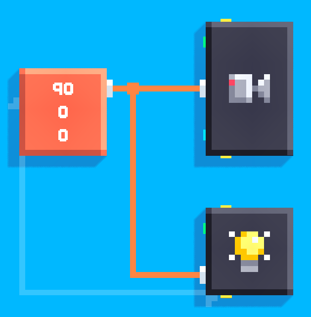
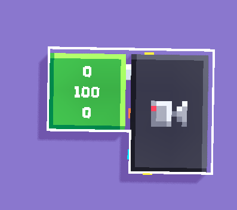

Sometimes in 2D games, we need to completely remove the shadows from the scene. Here is a simple way to do that.

1. Set the camera **angle** to          whatever is needed for the       game.

2. Set the light **angle** to the    **same** angle as the camera.

Example:

That's all!

But there might still be fuzzy shadow bleed at edges.

## For a perfect shadow removal

for a perfect shadow removal, we can move the camera very far from the scene. it is less convenient, but works perfectly.

For a top-down **2D** game, we can set the camera **Y** value to a **very high** value.

here is an example using camera X=0 and Z=0, 

Example: 
(you should use your appropriate camera X and Z values. Set The Y value to a very high value.)

For **3D** games, using this method is tricky and involves some math, so we don't talk it here.